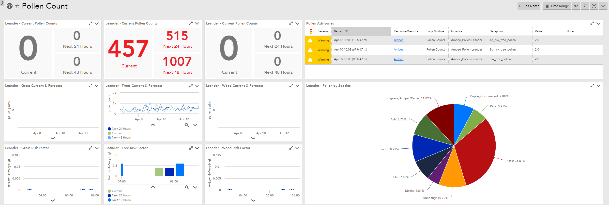

# Pollen Tracking DataSource and Dashboard

## Prerequisites
This DataSource utilizes a data service from Ambee. Sign up for a free or paid API account at [getambee.com](https://www.getambee.com/). The dashboard will give you an API token. Save this token to add as a property to the device during the configuration.
## Add the device
Add Ambee (api.ambeedata.com) into LogicMonitor as a device. You might consider turning off Ping, Certificates, and HTTP/S. Just know that if you do, this DataSource is not actually enough to indicate to LM that the device is not dead. You might want to leave one of them on. I left HTTP/S and Certificates turned on. 
### Locations
Create a property called `pollen_locations` that contains the locations you want to track. Each entry in the property will cause an additional instance, which means more API calls.
To construct the property, you'll need three attributes for each location you want to monitor:
1. The location's display name - this can be anything you want, but it should be unique.
2. The locations's latitude - in the format NN.NNNN (degrees). Positive for North, negative for South.
3. The location's longitude - in the format NN.NNNN (degrees). Positive for East, negative for West.

For each location, concatenate the three attributes, separated by commas like this: `New York,40.7128,-74.0060`, we'll call it the `location string`. Repeat this process for each location you want to monitor.
Once you have your list of location strings, combine them together (in any order) separated by a pipe symbol (`|`). This combined string will b the value of the `pollen_locations` property.
### Example
For example, if I wanted to track Leander, Dallas, and San Antonio, I'd add the following property:
`Leander,30.5788,-97.8531|Dallas,32.7767,-96.7970|San Antonio,29.4252,-98.4946`
### Authentication with the API
Create a property called `ambee_api.key` and make the value the API token available on the [Ambee API dashboard](https://api-dashboard.getambee.com/#/). 
## Add the DataSource
Import [the DataSource](DataSource.xml) into your LogicMonitor portal.
At this point, the instances defined in your `pollen_locations` property should show up as instances under the Ambee device. If they don't, kick of discovery manually and wait a few moments.
If you're tracking more than one location, you may want to decrease the poll interval. The default is 4 hours, so if you're monitoring two locations, you may want to set it to every 8 hours. For three devices, you may want to change it to every 12 hours. If you need to monitor more locations, consider a paid subscription to Ambee.
## Add the Dashboard (Optional)
Included in this repo is a [dashboard](Dashboard.json) that you can import. This dashboard is tokenized, so you'll need to modify the tokens to fit your use case. Changing the `##location##` token will change the names displayed on the dashboard and also select the instance whose data will be displayed. It should match the display name you defined in your `pollen_locations` property. Changing the `##latitude##` and `##longitude##` tokens will center the weather map on that location (since weather has a major impact on pollen counts). 