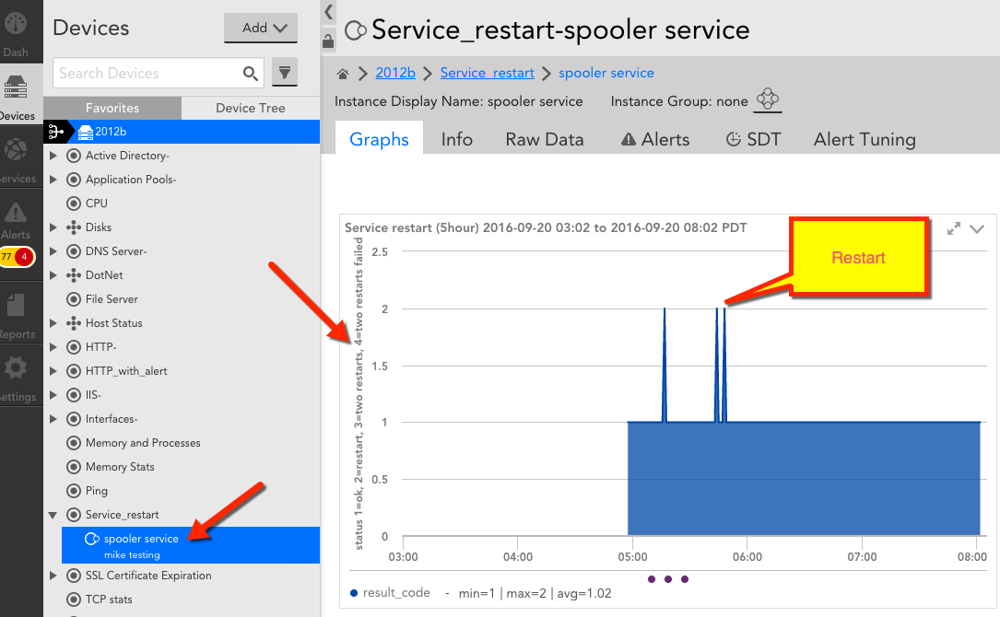

# DataSource to Automatically Restart Services if They Stop
This DataSource was originally written by Mike Suding while he was at LogicMonitor. I've since updated it to make it a bit less manual. To get started, read his blog post:

> LogicMonitor can easily alert you when a Windows service fails, but it sure would be nice to TRY to restart it automatically (and alert you if it cannot). This datasource does just that.
> If it’s running, then a value of “1” will show.
> If it’s stopped, it will try to restart and if it worked, then a value of “2” will show.
> If it’s still stopped, it will try a second time. If it worked, then a value of 3 will show.
> If it fails to start after two tries – a value of “4” will show.
> I chose this simple numbering because I set it to trigger a warning (yellow) if it’s 2; error (orange) if it’s 3 and critical (red) if it’s 4.
> INSTRUCTIONS:
Download this DataSource file then import it into your account. Settings > Datasources > Add > From file
> While you have your desired computer selected in Resources tree, add a monitored instance (blue down arrow > Add monitored instance. Type in the service name (e.g. Spooler) in the “wildcard” field. Give this instance a name and description. You can add additional instances on the “Instances” tab of right pane.
> Test by looking in the “Raw Data” tab and click ‘Poll now’. A value of 1 should show normally. Manually stop the service and you should see a 2 on the next ‘cycle’ which is at 1 minute interval.
> LIMITATIONS/DISCLAIMER: Official LogicMonitor tech support is not available. Use at your own risk.
> This currently requires the typical setup whereby your collector is running as a domain account and computer you are monitoring is also on that domain. i.e. I haven’t enhanced it to allow it to use wmi.user and wmi.pass properties specified on the device.
> 

# Current instructions:
Now, instead of adding the instances manually, you just combine the short name(s) of the service(s) you want monitored (and if necessary, restarted) into a pipe (|) separated list and add it as a property to the server, servers, or resource group containing all the servers with the name "Service_restart.services". Once you do (if you've imported the [DS xml](Service_restart.xml)), the services should be discovered and monitoring should start. If the service has to be restarted, it will open a minor alarm. If it can't be restarted successfully, it'll open a critical alarm (that bit hasn't changed).
